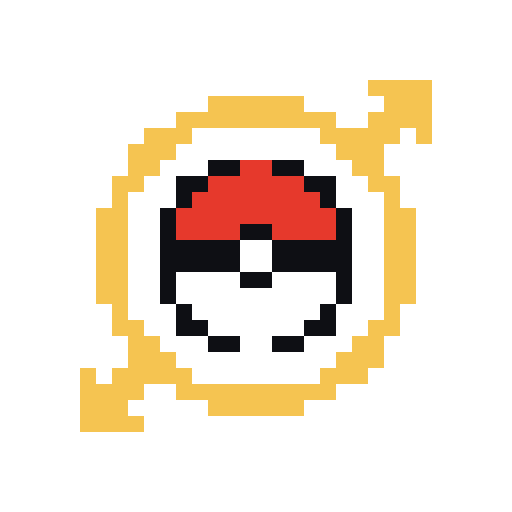

<div align="center">



# SoulSync

### **Your souls, linked in real time.** 🔗

Randomized **Soul Link Nuzlocke** runs with your crew — randomize, play, and watch your fates
intertwine **live**, all in a single window.

[](LICENSE)
[](https://github.com/TASEmulators/BizHawk)
[](#-quick-start)
[](#-contributing)
[](#-roadmap)

<!-- HERO GIF GOES HERE -->
> 🎬 _Demo GIF coming soon — gameplay + live dashboard in action._

</div>

---

## 💡 What is SoulSync?

You and your friends each play your **own randomized Pokémon run**. SoulSync **links your teams
together**: catch in the same order → your Pokémon become soul-linked. One faints? Its partner
faints too — **instantly, on everyone's screen**. No spreadsheets, no honor system, no setup.

SoulSync was **born from Soul Link**, but it's growing into a **platform for multiplayer
randomized challenges** — built for friends *and* streamers. Soul Link is the flagship mode;
more modes are on the [roadmap](#-roadmap). 🎥

> 🎮 Currently targets **Pokémon Black 2 / White 2**. More games are [coming](#-supported-games) — and easy to add.

---

## ✨ Features

| | |
|---|---|
| 🎲 **1-click randomize** | Full UPR-powered randomizer, fully customizable. No CLI, no fuss. |
| 🪟 **One window** | Emulator + dashboard fused together. No alt-tabbing. |
| 🔗 **Live soul-links** | Teams paired by catch order, in real time. |
| 💀 **Death cascade** | A linked Pokémon dies → its partners die too, on every screen. |
| 👥 **Multiplayer** | Host a room, share a link, play together. |
| 🌍 **Multilingual** | English, French… add your own with a single JSON file. |
| 🧩 **Multi-game ready** | Clean adapter system — contribute a new game without touching the emulator. |
| 🔒 **Your ROMs stay yours** | Bring your own ROM. We never bundle or distribute games. |

---

## 📸 Screenshots

> 🖼️ _Coming soon._ The in-game dashboard, the lobby, and the Game Over screen — styled like a DS.

---

## 🔗 How Soul Link works

```
   Player A                 Player B
   ────────                 ────────
   1st catch  ⇄  LINKED  ⇄  1st catch
   2nd catch  ⇄  LINKED  ⇄  2nd catch
   3rd catch  ⇄  LINKED  ⇄  3rd catch

   ☠️  A's 1st catch faints  →  B's 1st catch is marked dead too.
```

- **Pairing** is by **catch order** (permanent, by Pokémon ID — reordering your party is safe).
- **Death is forever.** When a whole team wipes → shared **Game Over**.
- Optional rules: species clause, first-battle protection, level cap, and more.

---

## 🚀 Quick start

1. **Download** the latest `SoulSync-Setup.exe` from [Releases](../../releases).
2. **Run it.** Everything's bundled (emulator, randomizer, Java).
3. **Bring your own** Pokémon Black 2 / White 2 ROM (`.nds`).
4. Click **🎲 Randomize & Play** — and link up with your crew.

<details>
<summary><b>🛠️ Build from source</b></summary>

```bash
git clone https://github.com/Elkios/SoulSync-Emu.git
cd SoulSync-Emu
dotnet build BizHawk.sln -c Release
# → output/EmuHawk.exe
```
Requires the .NET SDK pinned in `global.json` (.NET 8) and the WebView2 runtime
(preinstalled on Windows 11). See [`docs/ARCHITECTURE.md`](docs/ARCHITECTURE.md).
</details>

---

## 🎮 Supported games

| Game | System | Status |
|------|--------|--------|
| **Black 2 / White 2** | NDS | ✅ Supported |
| HeartGold / SoulSilver | NDS | 🔜 Planned |
| Diamond / Pearl / Platinum | NDS | 🔜 Planned |
| Your favorite game | — | 🙌 [Add it!](docs/ADDING_A_GAME.md) |

Adding a game = one self-contained adapter. No emulator hacking required.

---

## 🌐 Multiplayer & self-hosting

- **Play together:** one player hosts a room and shares a join link; everyone sees every team live.
- **Host the server your way:** run it **locally** (built-in) or deploy the **standalone relay server**
  to a VPS / Render / Railway — clients just dial out, no port-forwarding.

📖 See [`docs/HOSTING_A_SERVER.md`](docs/HOSTING_A_SERVER.md).

---

## 🗺️ Roadmap

- [x] Single-window emulator + dashboard (WebView2)
- [x] Brand & logo
- [ ] B2W2 adapter ported to the new architecture
- [ ] Polished live dashboard (DS-styled)
- [ ] Room browser + lobby
- [ ] Local **and** external relay server
- [ ] More games (HGSS, DPPt, …)
- [ ] More modes (beyond Soul Link — friends & streamers) 🎥
- [ ] Full i18n coverage

_More to come — suggestions welcome via [issues](../../issues)._

---

## 🤝 Contributing

PRs welcome! The architecture is built so you can contribute **without fighting the emulator**:

- 🧩 **Add a game** → [`docs/ADDING_A_GAME.md`](docs/ADDING_A_GAME.md) — write one adapter, test it with a RAM dump.
- 🌍 **Add a language** → [`docs/ADDING_A_LANGUAGE.md`](docs/ADDING_A_LANGUAGE.md) — drop a JSON file.
- 🎨 **Improve the UI** → it's web tech (HTML/CSS/JS), mockable in a plain browser.

Start with [`CONTRIBUTING.md`](docs/CONTRIBUTING.md) and [`docs/ARCHITECTURE.md`](docs/ARCHITECTURE.md).

---

## 🏗️ Architecture

A clean, layered .NET monorepo with a strict dependency rule — game logic never touches the
emulator, so it's testable and portable. Full write-up in [`docs/ARCHITECTURE.md`](docs/ARCHITECTURE.md).

---

## 🙏 Credits

- [**BizHawk**](https://github.com/TASEmulators/BizHawk) — the multi-system emulator SoulSync is forked from (MIT).
- [**melonDS**](https://github.com/melonDS-emu/melonDS) — the DS core (GPL v3).
- [**Universal Pokémon Randomizer ZX**](https://github.com/Ajarmar/universal-pokemon-randomizer-zx) — randomization engine.
- [**PokeAPI**](https://pokeapi.co/) — sprites & species data.

---

## ⚖️ Legal

SoulSync **does not include, distribute, or link to any ROMs**. You must supply your own,
legally obtained game files. SoulSync is a fan-made tool, not affiliated with or endorsed by
Nintendo, Game Freak, or The Pokémon Company.

---

## 📄 License

SoulSync is released under the [MIT License](LICENSE) (inherited from BizHawk).
Note: the bundled melonDS core is GPL v3 — see its license for redistribution terms.

<div align="center">

**Randomize. Link up. Survive — together.** 🔗

</div>
